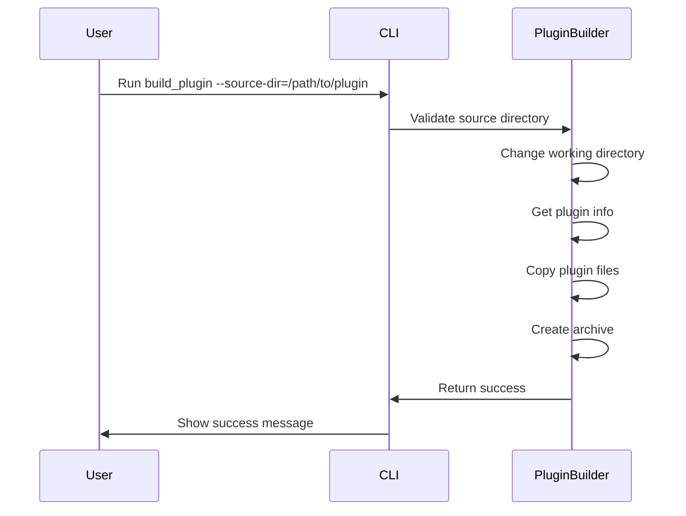

# Plan: Add --source-dir Option to CLI

## Overview
Add a new CLI option `--source-dir` that allows specifying an alternative plugin source directory while maintaining the current working directory as default.

## Implementation Steps

### 1. Add the CLI option
```python
@click.option('--source-dir', default='.', help='Specify plugin source directory (default: current directory)')
```

### 2. Modify plugin information retrieval
Update `get_plugin_info()` to accept source_dir parameter:
```python
def get_plugin_info(source_dir='.', verbose=False, console=None):
    # Change current implementation to use source_dir
    # Instead of os.getcwd(), use Path(source_dir)
```

### 3. Update file copying logic
Modify `copy_plugin_files()` to use the source directory:
```python
def copy_plugin_files(temp_dir, plugin_name, source_dir='.', verbose=False, console=None):
    # Change current implementation to copy from source_dir instead of cwd
```

### 4. Pass source_dir through the workflow
Update the main command to pass the source_dir parameter:
```python
def build_plugin(output_dir, no_sync, notify_slack, verbose, source_dir):
    # ...
    plugin_name, version, original_version = get_plugin_info(
        source_dir=source_dir, 
        verbose=verbose, 
        console=console
    )
    # ...
    plugin_dir = copy_plugin_files(
        temp_dir, 
        plugin_name, 
        source_dir=source_dir,
        verbose=verbose, 
        console=console
    )
```

### 5. Update git operations
Modify git-related functions to work in the specified source directory:
```python
# In get_git_info(), check_git_status(), etc. add:
os.chdir(source_dir)  # Temporarily change working directory
# Perform git operations
os.chdir(original_cwd)  # Restore original directory
```

### 6. Add validation
Verify the source directory exists and contains a valid plugin:
```python
if not os.path.isdir(source_dir):
    raise click.UsageError(f"Source directory not found: {source_dir}")
if not os.path.exists(os.path.join(source_dir, 'composer.json')):
    raise click.UsageError("No composer.json found in source directory")
```

### 7. Update documentation
Modify the command help text to mention the new option:
```python
def build_plugin(output_dir, no_sync, notify_slack, verbose, source_dir):
    """
    Build and package Shopware 6 plugin for release.
    
    --source-dir: Specify alternative plugin location (default: current directory)
    """
```

## Sequence Diagram


## Questions for User
1. Should we maintain git operations in the source directory or original working directory?
2. Do we need to handle relative vs absolute paths differently?
3. Should we add a configuration option to set a default source directory in .env?