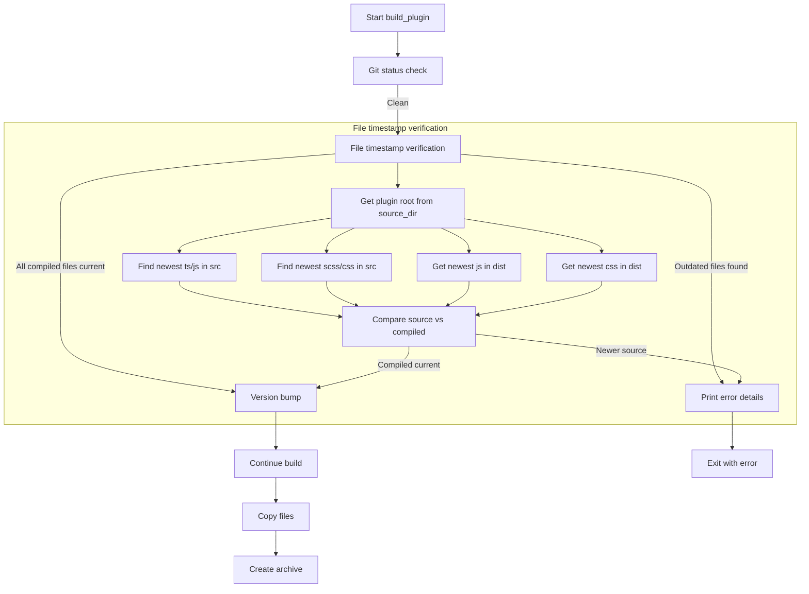

# Implementation Plan: File Timestamp Verification Before Package Build

## Objective
Add a pre-build check to ensure compiled JavaScript and CSS files in `dist/` are newer than the newest source files of their respective types before proceeding with version bumping and packaging.

## Problem Statement
The current 1:1 file mapping approach is inefficient and doesn't account for complex build processes where multiple source files contribute to a single compiled output. We need a more robust solution that compares timestamps by file type using the plugin root directory.

## Solution Overview


## Implementation Details

### 1. Verification Function (plugin.py)
```python
def verify_compiled_files(source_dir, verbose=False, console=None):
    """Verify compiled files are newer than newest source files by type"""
    # Use provided source_dir as plugin root
    src_dir = os.path.join(source_dir, 'src')
    dist_dir = os.path.join(source_dir, 'dist')
    
    # Get newest source file timestamps
    js_sources = get_newest_mtime(src_dir, ['.ts', '.js'])
    css_sources = get_newest_mtime(src_dir, ['.scss', '.css'])
    
    # Get compiled file timestamps
    js_compiled = get_newest_mtime(dist_dir, ['.js'])
    css_compiled = get_newest_mtime(dist_dir, ['.css'])
    
    # Compare timestamps
    errors = []
    if js_sources > js_compiled:
        errors.append(f"JavaScript: Source ({js_sources}) > Compiled ({js_compiled})")
    if css_sources > css_compiled:
        errors.append(f"CSS: Source ({css_sources}) > Compiled ({css_compiled})")
    
    if errors:
        if console:
            console.print("[bold red]Error:[/] Compiled files are outdated:")
            for error in errors:
                console.print(f"- {error}")
            console.print(f"[bold]Source directory:[/] {src_dir}")
            console.print(f"[bold]Compiled directory:[/] {dist_dir}")
        return False
    return True

def get_newest_mtime(directory, extensions):
    """Get newest modification time for files with given extensions"""
    if not os.path.exists(directory):
        return 0
        
    newest = 0
    for root, _, files in os.walk(directory):
        for file in files:
            if any(file.endswith(ext) for ext in extensions):
                path = os.path.join(root, file)
                mtime = os.path.getmtime(path)
                if mtime > newest:
                    newest = mtime
    return newest
```

### 2. CLI Integration (cli.py)
```python
# After git status check (line 66)
status.update("[bold blue]Verifying compiled files...")
if not verify_compiled_files(source_dir, verbose=verbose, console=console):
    console.print("[bold red]Build aborted due to outdated compiled files[/]")
    exit(1)

# Only after both checks pass, proceed to version bump
status.stop()
major_version = get_major_version(original_version)
choices = [ ... ]
# ... rest of version bumping code
```

### 3. Error Handling
If outdated files are found:
```
[bold red]Error:[/] Compiled files are outdated:
- JavaScript: Source (1720983600) > Compiled (1720980000)
- CSS: Source (1720987200) > Compiled (1720976400)
[bold]Source directory:[/] /path/to/plugin/src
[bold]Compiled directory:[/] /path/to/plugin/dist
[bold red]Build aborted due to outdated compiled files[/]
```

## Benefits
1. Uses plugin root directory consistently with build process
2. More efficient than 1:1 file checks
3. Handles complex build processes with multiple source files
4. Prevents version bumps when builds would fail due to outdated files

## Next Steps
1. Implement the solution in code mode
2. Test with various timestamp scenarios
3. Update documentation to reflect new approach