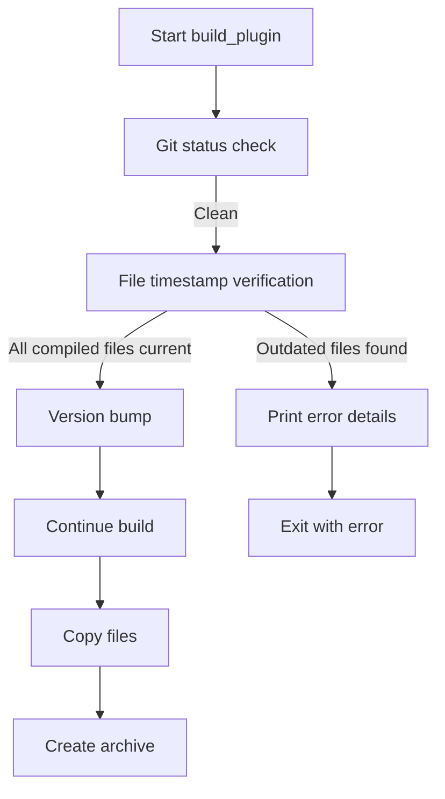

# Implementation Plan: File Timestamp Verification Before Package Build

## Objective
Add a pre-build check to ensure compiled JavaScript files in `dist/` are newer than their source files before proceeding with version bumping and packaging.

## Problem Statement
Currently, the build process doesn't verify if compiled files are up-to-date with their source files. This can lead to packaging outdated code, causing runtime errors in production.

## Solution Overview


## Implementation Details

### 1. Verification Function (plugin.py)
```python
def verify_compiled_files(verbose=False, console=None):
    """Verify compiled files are newer than source files."""
    compiled_dir = 'dist'
    
    if not os.path.exists(compiled_dir):
        if verbose and console:
            console.print(f"[yellow]Warning:[/] Compiled directory '{compiled_dir}' not found")
        return True

    outdated_files = []
    for root, _, files in os.walk(compiled_dir):
        for file in files:
            if file.endswith('.js'):
                compiled_path = os.path.join(root, file)
                compiled_mtime = os.path.getmtime(compiled_path)
                
                # Find corresponding source file
                source_path = compiled_path.replace(compiled_dir, 'src').replace('.js', '.ts')
                if not os.path.exists(source_path):
                    source_path = source_path.replace('.ts', '.js')
                    if not os.path.exists(source_path):
                        continue
                
                if os.path.getmtime(source_path) > compiled_mtime:
                    outdated_files.append({
                        'compiled': compiled_path,
                        'source': source_path,
                        'compiled_mtime': compiled_mtime,
                        'source_mtime': os.path.getmtime(source_path)
                    })
    
    if outdated_files:
        if console:
            console.print("[bold red]Error:[/] Compiled files are outdated:")
            for file in outdated_files:
                console.print(f"- {file['compiled']} (compiled: {file['compiled_mtime']})")
                console.print(f"  is older than {file['source']} (modified: {file['source_mtime']})")
        return False
    return True
```

### 2. CLI Integration (cli.py)
```python
# After git status check (line 66)
status.update("[bold blue]Verifying compiled files...")
if not verify_compiled_files(verbose=verbose, console=console):
    console.print("[bold red]Build aborted due to outdated compiled files[/]")
    exit(1)

# Only after both checks pass, proceed to version bump
status.stop()
major_version = get_major_version(original_version)
choices = [ ... ]
# ... rest of version bumping code
```

### 3. Error Handling
If outdated files are found:
```
[bold red]Error:[/] Compiled files are outdated:
- dist/main.js (compiled: 1720980000)
  is older than src/main.ts (modified: 1720983600)
- dist/utils.js (compiled: 1720976400)
  is older than src/utils.ts (modified: 1720987200)
[bold red]Build aborted due to outdated compiled files[/]
```

## Benefits
1. Prevents version bumps when builds would fail due to outdated files
2. Avoids unnecessary commits and tags for failed builds
3. Maintains clean version history
4. Provides early feedback to developers

## Next Steps
1. Implement the solution in code mode
2. Test with both valid and outdated file scenarios