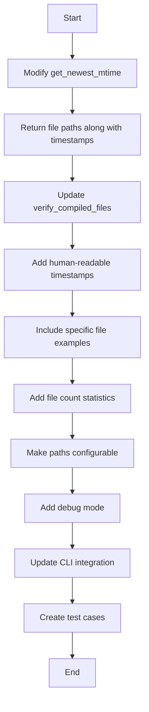

# Implementation Plan: Verbose Timestamp Verification

## Problem Analysis
The current timestamp verification implementation has these limitations:
1. Shows raw timestamps (unreadable numbers)
2. Doesn't identify specific outdated files
3. Uses hardcoded Shopware paths
4. Lacks diagnostic details for debugging
5. Doesn't show file counts for context

## Solution Overview


## Implementation Details

### 1. Enhance `get_newest_mtime` (plugin.py)
- Return tuple `(timestamp, example_file, file_count)` instead of just timestamp
- Track newest file path and count matching files

```python
def get_newest_mtime(directory: str, extensions: Iterable[str]) -> tuple[float, str, int]:
    # ... existing code ...
    newest_file = ""
    file_count = 0
    for root, _dirs, files in os.walk(directory):
        for file_name in files:
            if any(file_name.endswith(ext) for ext in extensions):
                file_count += 1
                path = os.path.join(root, file_name)
                try:
                    mtime = os.path.getmtime(path)
                    if mtime > newest:
                        newest = mtime
                        newest_file = path  # Track newest file path
                except OSError:
                    continue
    return newest, newest_file, file_count
```

### 2. Update `verify_compiled_files` (plugin.py)
- Add human-readable timestamps using `time.ctime()`
- Show specific outdated files in debug mode
- Include file counts in error messages
- Make paths configurable via parameters

```python
def verify_compiled_files(
    source_dir: str = '.', 
    *,
    src_path: str = 'src/Resources/app/storefront/src',  # Configurable
    dist_path: str = 'src/Resources/app/storefront/dist', # Configurable
    verbose: bool = False, 
    debug: bool = False,  # New debug mode
    console=None
) -> bool:
    src_dir = os.path.join(source_dir, src_path)
    dist_dir = os.path.join(source_dir, dist_path)
    
    # Get timestamps with example files and counts
    js_sources, js_source_file, js_source_count = get_newest_mtime(src_dir, ('.ts', '.js'))
    css_sources, css_source_file, css_source_count = get_newest_mtime(src_dir, ('.scss', '.css'))
    js_compiled, js_compiled_file, js_compiled_count = get_newest_mtime(dist_dir, ('.js',))
    css_compiled, css_compiled_file, css_compiled_count = get_newest_mtime(dist_dir, ('.css',))
    
    errors: list[str] = []
    if js_sources > js_compiled:
        errors.append(f"JavaScript: Source ({time.ctime(js_sources)}) > Compiled ({time.ctime(js_compiled)})")
    if css_sources > css_compiled:
        errors.append(f"CSS: Source ({time.ctime(css_sources)}) > Compiled ({time.ctime(css_compiled)})")
    
    if errors:
        if console:
            console.print("[bold red]Error: Compiled files are outdated[/]")
            for err in errors:
                console.print(f"- {err}")
            
            # New verbose output
            console.print(f"\n[bold]Source directory:[/] {src_dir} ({js_source_count} JS/TS, {css_source_count} CSS/SCSS files)")
            console.print(f"[bold]Compiled directory:[/] {dist_dir} ({js_compiled_count} JS, {css_compiled_count} CSS files)")
            
            if debug:  # Detailed debug info
                console.print("\n[bold]Specific files causing issues:[/]")
                if js_sources > js_compiled:
                    console.print(f"- JS: {js_source_file} ({time.ctime(js_sources)})")
                    console.print(f"  vs {js_compiled_file} ({time.ctime(js_compiled)})")
                if css_sources > css_compiled:
                    console.print(f"- CSS: {css_source_file} ({time.ctime(css_sources)})")
                    console.print(f"  vs {css_compiled_file} ({time.ctime(css_compiled)})")
        return False
```

### 3. Update CLI Integration (cli.py)
- Add debug flag to CLI options
- Pass path parameters from configuration
- Update status messages

```python
# Add debug option to CLI
@click.option('--debug', is_flag=True, help='Enable debug output for timestamp verification')

# In build command:
status.update("[bold blue]Verifying compiled files...")
if not verify_compiled_files(
    source_dir,
    src_path=config.SRC_PATH,  # From configuration
    dist_path=config.DIST_PATH, # From configuration
    verbose=verbose,
    debug=debug,  # New debug flag
    console=console
):
    console.print("[bold red]Build aborted due to outdated compiled files[/]")
    exit(1)
```

### 4. Configuration (config.py)
- Add default path configuration
- Allow environment variable overrides

```python
# Default paths for timestamp verification
SRC_PATH = os.environ.get('SRC_PATH', 'src/Resources/app/storefront/src')
DIST_PATH = os.environ.get('DIST_PATH', 'src/Resources/app/storefront/dist')
```

### 5. Testing Plan
1. **Human-readable timestamps**: Verify timestamps show in readable format
2. **Path configuration**: Test with custom directory structures
3. **Debug output**: Verify specific files are shown when debug flag is set
4. **File counts**: Confirm counts match actual files in directories
5. **Error handling**: Test with:
   - Missing source directory
   - Empty compiled directory
   - Partially outdated files
6. **Performance**: Ensure large directories don't cause performance issues

## Benefits
1. Actionable error messages with human-readable timestamps
2. Specific file examples for faster debugging
3. Configurable paths for different project structures
4. File counts provide context about verification scope
5. Debug mode offers detailed diagnostics
6. Maintains backward compatibility

## Next Steps
1. Review this plan
2. Approve for implementation
3. Switch to code mode for execution